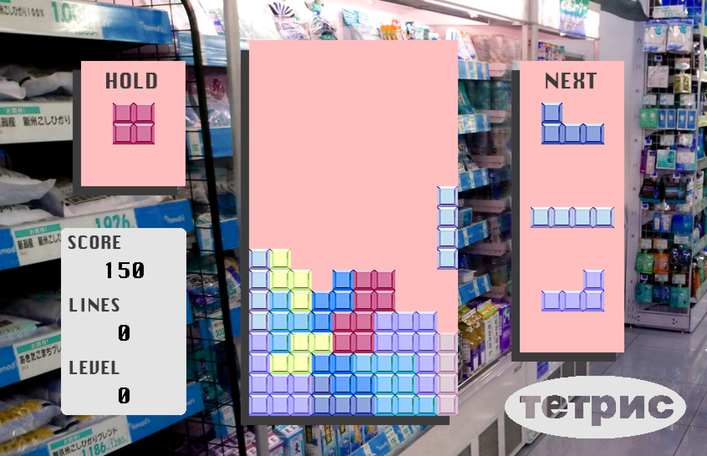

# tetpnc
A TETRIS CLONE.

# Description

A Tetris clone made using Simple DirectMedia Layer. I have implemented wall kicks, holding, and high scores.

All textures, sounds, and music were made by me.

**This was made for educational purposes only.**

# Controls

- *Left/Right* - Move the block left or right.
- *Down* - Make the block fall at a faster rate.
- *Space* - Drop the block immediately (hard drop).
- *x/Up* - Rotate the block clockwise.
- *z* - Rotate the block counterclockwise.
- *c* - Hold the block.
- *Escape* - Pause the game.
- *1* - Mute/Unmute the game.

# Installation

This game will only work on Mac and Linux.

After downloading:

1. Extract the tetpnc-master folder
2. Open a terminal window and cd to the folder containing the source files
3. Use the command *make all*
4. Run the game with the command *./tetpnc*
